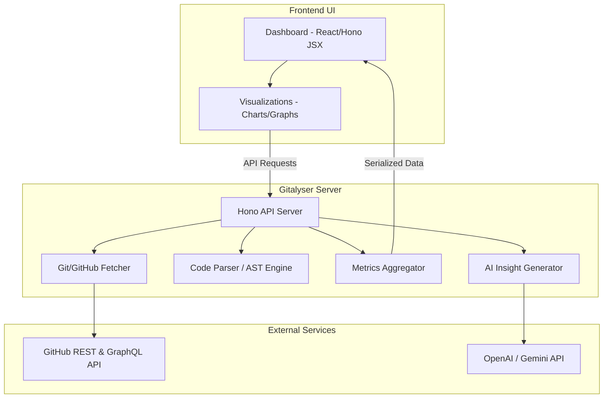

# Gitalyser - GitHub Repository Analyser

Gitalyser is a comprehensive tool designed to analyze GitHub repositories and generate rich insights into codebase architecture, commit activity, developer collaboration patterns, code complexity, and dependency health. It provides developers, maintainers, and team leads with actionable metrics to improve code quality and workflow efficiency.

---

## 🚀 Core Features

- **📊 Repository Metadata & Health Indicators**
  - Track stars, forks, open/closed issues, and pull request trends.
  - Multi-language breakdown and file size distribution.

- **📈 Activity & Contribution Analysis**
  - Visualizing commit frequency and frequency patterns (contribution heatmaps).
  - Contribution breakdown by author.
  - Code churn metrics (lines added vs. lines deleted over time).

- **🔍 Code Quality & Complexity (AST Analysis)**
  - File/directory structure visualization.
  - Cyclomatic complexity profiling for TypeScript/JavaScript code.
  - Line-of-code metrics (Source lines vs. comments/whitespace).

- **📦 Dependency & Security Audits**
  - Dependency tree visualization.
  - Vulnerability scans and alerts for outdated packages.
  - License compliance reporting.

- **🤝 Collaboration & Team Dynamics**
  - Pull Request lifecycle metrics (average time-to-merge, review turnaround times).
  - "Bus Factor" calculations to identify knowledge silos within the team.

- **🤖 AI-Powered Repository Summarization**
  - AI analysis of commit history to summarize development milestones.
  - Automatic generation of high-level architectural summaries.

---

## 🏛️ System Architecture



### Key Modules:
1. **GitHub Data Fetcher**: Interacts with the GitHub API (REST & GraphQL via Octokit) to fetch repository metadata, commit histories, PR data, and issues.
2. **Code Parser & Analyzer**: Parses cloned or fetched source code using Abstract Syntax Trees (AST) to measure code complexity, volume, and structure.
3. **Metrics Aggregator**: Normalizes and structures the raw git/code data into digestible visual data points.
4. **AI Insight Generator**: Integrates with LLMs to provide context-aware repository walkthroughs, code quality suggestions, and release summaries.

---

## ⚙️ How It Works

1. **Input**: The user inputs a GitHub repository URL (public or authorized private).
2. **Fetch**: The backend queries GitHub APIs to extract metadata, files, issues, pull requests, and commit logs.
3. **Parse**: The Code Parser evaluates files, analyzing syntax trees and extracting dependency listings (e.g., `package.json`).
4. **Analyze**: The server aggregates metrics like code churn, contribution heatmaps, and complexity levels.
5. **Render**: The frontend visualizes these findings using interactive charts, dependency graphs, and code maps.

---

## 🛠️ Technology Stack

- **Framework**: [Hono](https://hono.dev/) (Lightweight, ultra-fast web framework)
- **Runtime**: Node.js / Vercel Edge Functions
- **Language**: TypeScript
- **Bundler/Dev Tooling**: TSX, TypeScript compiler
- **Hosting/Deployment**: Vercel

---

## 💻 Getting Started

### Prerequisites

- [Vercel CLI](https://vercel.com/docs/cli) installed globally:
  ```bash
  npm install -g vercel
  ```

### Development Setup

1. **Clone the repository and install dependencies:**
   ```bash
   npm install
   ```

2. **Start the local development server:**
   ```bash
   vc dev
   ```
   This will spin up the Hono development server at `http://localhost:3000`.

### Build & Deploy

- **Build locally:**
  ```bash
  vc build
  ```

- **Deploy to Vercel:**
  ```bash
  vc deploy
  ```
